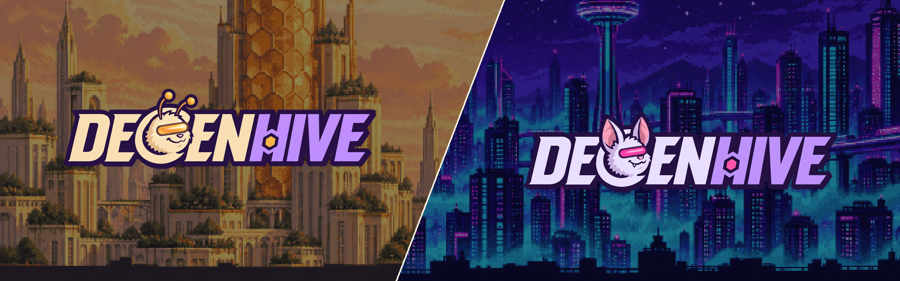

  

# DegenHive

**An open protocol for meme communities on tokenized stocks, on Robinhood Chain and Solana.**

Hold memecoins and baskets of tokenized stocks in your Desk and earn a share of every trade others make. Stake a Lab's token to share its daily DGV and its fees, and earn points in the Lab's own app: a game, an AI agent, quests, anything a developer vibe-codes.

| | |
|---|---|
| **Desk** | Your account. What it holds earns holder yield. |
| **Stacks** | Managed baskets of tokenized stocks, always redeemable for the stocks. |
| **Memes** | Memecoins that launch on a curve, graduate into a locked pool and pay their holders. |
| **Labs** | Communities on one token: stake to earn, play the Lab's app for points. |
| **Characters** | 11,111 Stingvestors on Robinhood Chain and 11,111 Fangvestors on Solana. |
| **DGV** | One token on both chains. The Comb only ever buys it; lockers earn ETH and SOL. |

**Read more:** [Whitepaper](https://docs.degenhive.ai) · [App](https://degenhive.ai) · [X](https://x.com/DegenHive)
